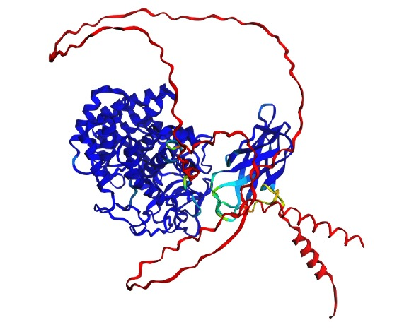
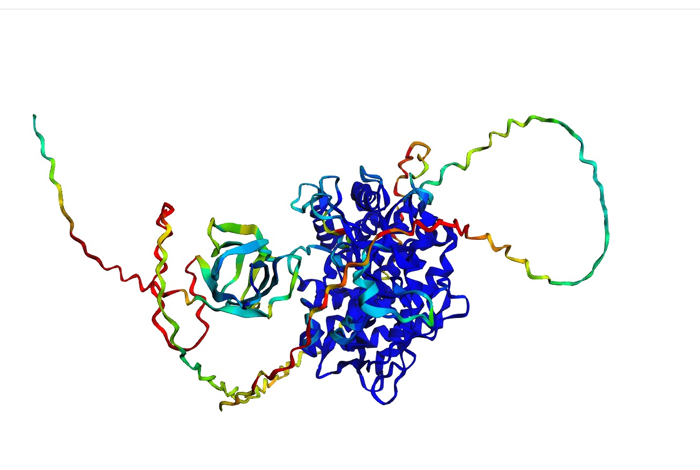
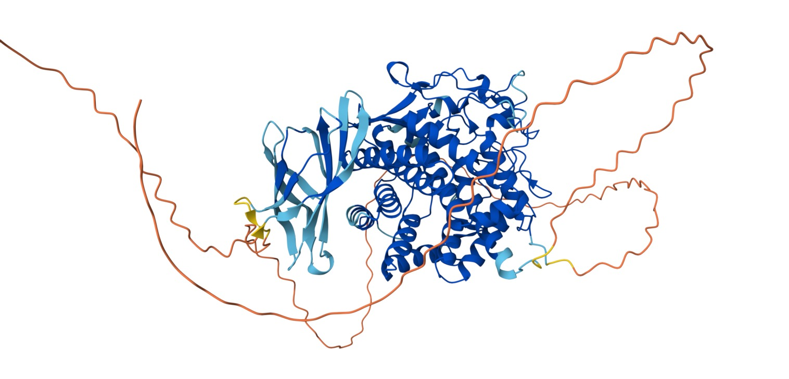

# AlphaFold2 y algoritmos similares

## Objetivo

En esta práctica se buscó:

1. Recuperar la secuencia de una proteína de interés.
2. Realizar **predicciones de estructura terciaria** con distintos algoritmos como _AlphaFold_ (2 y 3), _MMSeqs2_ y _Rosetta_.
3. Evaluar su calidad con métricas cuantitativas de similitud estructural (*% identidad*, *RMSD*, *plIDDT*, *TM-score*) entre las predicciones.

## 1. Secuencia de la proteína de interés

Tras un análisis de PGLS (longevity ~ OG, número de copias por especie), se identificaron ortogrupos cuya expansión o contracción se relaciona con la longevidad. De estos, se seleccionó un ortogrupo significativo y se observó que las proteínas que lo conforman aún no están caracterizadas. Sin embargo, se sabe que presentan un dominio Glycosyl hydrolase family 9. Conocer su estructura permitiría inferir su función molecular, identificar posibles sitios activos o de interacción, y comprender su papel potencial en los mecanismos asociados a la longevidad.

La secuencias fue tomada de _Argpecten irradians_, disponible en [NCBI](https://www.ncbi.nlm.nih.gov/protein/XP_069105272.1/) y en el archivo `./data/XP_069105272.1_seq.faa`.

## 2. Predicciones de estructura terciaria con _AF2_, _AF3_ y _Rosetta_

Para el caso de _AF2_, se utilizó la implementación del modelo disponible en el siguiente [Google Colab](https://colab.research.google.com/github/sokrypton/ColabFold/blob/main/AlphaFold2.ipynb#scrollTo=mbaIO9pWjaN0), relizando dos ejecuciones independientes con los siguientes parámetros:

- `num_relax`: 1
- `template_mode`: pdb100
- `msa_mode`: mmseqs2_uniref_env
- `pair_mode`: unpaired_paired
- `num_recycles`: 6

El resto de los parámetros se dejaron con las opciones *default*. Con lo anterior, se utilizaron dos estructuras por corrida, cuatro en total, recuperando las dos mejor ranqueadas, puesto que una correspondía a la estructura relajada y la segunda a la estructura sin relajar (ver **Figuras 1** y **2**). En los casos de *AF3* y *Rosetta*, los parámetros también se mantuvieron por defecto (ver **Figura 3**). Las estructuras relajadas ocuparon el primer puesto en el ranking debido a que pasan por un proceso de minimización energética mediante el campo de fuerza Amber, lo que corrige posibles *clashes* estéricos y optimiza la geometría local (longitudes de enlace, ángulos y torsiones), reduciendo la energía total del sistema sin modificar de manera significativa el plegamiento global predicho por la red neuronal.

Para cualquier caso, el core de la proteína presentó los mejores scores de _pLDDT_ que es usual para los núcleos protéicos, mientras que los residuos con mayor accesibilidad al solvente exhiben menor confianza en la predicción de la red neuronal (ver **Figuras 1-3**).

## 3. Métricas de calidad de la estructura

Ya se ha mencionado el _predicted Local Distance Difference Test_ (_pLDDT_) como primer aproximación a la calidad de la estructura predicha, sin embargo, existen otras como el _RMSD_, _TM-score_ y el _IDDT_ (este último se diferencia del _pLDDT_ en que evalúa la predicción con respecto a la estructura experimental conocida).

Para este ejercicio se diseñó el wrapper `./src/comparando_estructuras.py`, el cual permite comparar la combinatoria para un set de archivos `.pdb` dentro de un directorio al computar la superposición de las estructuras que almacenan, devolviendo valores como el total de residuos para cada estructura, los residuos alineados con una estructura como referencia, el _RMSD_ y la identidad del alinemiento (ver **Tabla 1**).

| Modelos comparados                       | Residuos_1 | Residuos_2 | Alineados | RMSD               | Identidad |
|------------------------------------------|------------|------------|-----------|--------------------|-----------|
| first_AF2_relaxed_first_AF2_unrelaxed    | 726.0      | 726.0      | 320.0     | 0.1279473447077379 | 100.0     |
| first_AF2_relaxed_second_AF2_relaxed     | 726.0      | 726.0      | 320.0     | 0.6067481582951278 | 100.0     |
| first_AF2_unrelaxed_second_AF2_relaxed   | 726.0      | 726.0      | 320.0     | 0.6243310456394234 | 100.0     |
| AF3_model_second_AF2_relaxed             | 726.0      | 726.0      | 320.0     | 24.035613176364535 | 100.0     |
| AF3_model_first_AF2_relaxed              | 726.0      | 726.0      | 320.0     | 24.10725302191436  | 100.0     |
| AF3_model_first_AF2_unrelaxed            | 726.0      | 726.0      | 320.0     | 24.112092525202343 | 100.0     |
| rosetta_model_second_AF2_relaxed         | 726.0      | 726.0      | 320.0     | 28.11468506153404  | 100.0     |
| first_AF2_relaxed_rosetta_model          | 726.0      | 726.0      | 320.0     | 28.26699585649576  | 100.0     |
| first_AF2_unrelaxed_rosetta_model        | 726.0      | 726.0      | 320.0     | 28.273277380423263 | 100.0     |
| second_AF2_relaxed_second_AF2_unrelaxed  | 726.0      | 726.0      | 320.0     | 28.826657551765457 | 100.0     |
| first_AF2_relaxed_second_AF2_unrelaxed   | 726.0      | 726.0      | 320.0     | 28.952321165027474 | 100.0     |
| first_AF2_unrelaxed_second_AF2_unrelaxed | 726.0      | 726.0      | 320.0     | 28.958034122606303 | 100.0     |
| rosetta_model_second_AF2_unrelaxed       | 726.0      | 726.0      | 320.0     | 29.4030280331586   | 100.0     |
| AF3_model_rosetta_model                  | 726.0      | 726.0      | 320.0     | 29.862755995982887 | 100.0     |
| AF3_model_second_AF2_unrelaxed           | 726.0      | 726.0      | 320.0     | 31.599952470400904 | 100.0     |
**Tabla 1.** Valores obtenidos de la combinatoria en la comparación de estructuras.

Los resultados de la ***Tabla 1*** muestran que las estructuras generadas con AF2 son altamente consistentes entre sí, presentando valores de _RMSD_ muy bajos (< 1 Å) cuando se comparan las versiones relajadas y no relajadas de una misma corrida, así como entre corridas independientes. En particular, la comparación entre `first_AF2_relaxed` y `first_AF2_unrelaxed` arrojó un _RMSD_ de 0.13 Å, lo que confirma que el proceso de relajación no altera el plegamiento global, sino únicamente la geometría local. De manera similar, las comparaciones entre modelos de AF2 de distintas ejecuciones mantienen valores de _RMSD_ cercanos a 0.6 Å, lo que indica alta reproducibilidad estructural bajo los mismos parámetros. En contraste, los modelos generados con AF3 y Rosetta presentan valores de _RMSD_ considerablemente mayores (24–31 Å y 28–30 Å, respectivamente) al compararse con los modelos de AF2, lo que sugiere diferencias importantes en la conformación global predicha. Esto indica que, geométricamente, los modelos de AF2 forman un conjunto estructuralmente coherente, mientras que _AF3_ y _Rosetta_ exploran conformaciones alternativas aparentemente distintas.

| Estructura\Métrica  | IDDT | RMSD | TM-score |
|---------------------|------|------|----------|
| first_AF2_unrelaxed | 0.95 | 1.00 | 0.12     |
| AF3                 | 0.91 | 0.61 | 30.65    |
**Tabla 2.** Métricas obtenidas con la estructura `./data/first_AF2_relaxed.pdb` como referencia en ***Swiss Model Assess Structure***.

| Estructura\Métrica  | IDDT | RMSD | TM-score |
|---------------------|------|------|----------|
| second_AF2_unrelaxed | 0.88 | 0.62 | 33.25    |
**Tabla 3.** Métricas obtenidas con la estructura `./data/second_AF2_relaxed.pdb` como referencia en ***Swiss Model Assess Structure***.

Habiendo hecho esto quisimos conocer qué tan distintos eran los modelos con respecto a las mejores estructuras, para ello utilizamos _Structure Assesment_ de [Swiss Model](https://swissmodel.expasy.org/assess) y utilizamos sólo as estructuras menos similares, es decir, las versiones `unrelaxed` de _AF2_ y el proveniente de _AF3_. Obteniendo así las **Tablas 2-3**.

En términos generales, los modelos muestran una alta convergencia estructural. Los valores de RMSD inferiores a 1 Å e IDDT superiores a 0.88 indican que las diferencias entre las mejores estructuras son marginales y se limitan principalmente a ajustes locales, sin alterar la arquitectura global de la proteína. Esto sugiere una predicción robusta y consistente entre corridas y algoritmos (ver **Tablas 2-3** y **Figuras 4-6**).

## Conclusión

En esta práctica se logró predecir y comparar la estructura terciaria de una proteína perteneciente a un ortogrupo asociado con longevidad, utilizando distintos algoritmos de modelado estructural. Los resultados muestran que las predicciones generadas con _AlphaFold2_ presentan una alta reproducibilidad y consistencia interna, evidenciada por valores de RMSD inferiores a 1 Å entre corridas independientes y entre versiones relajadas y no relajadas. Esto confirma que el proceso de relajación energética no modifica el plegamiento global, sino que únicamente optimiza la geometría local.

Asimismo, el análisis con _Swiss Model Structure Assessment_ corroboró que las diferencias entre las mejores estructuras son mínimas (IDDT > 0.88), lo que indica una alta similitud estructural y una predicción robusta. Aunque los modelos generados con AF3 y Rosetta mostraron mayores discrepancias globales al compararse directamente con los modelos de _AF2_, las evaluaciones específicas frente a las estructuras de referencia revelan que las variaciones se concentran principalmente en regiones flexibles o superficiales, sin alterar la arquitectura central del dominio Glycosyl hydrolase family 9.

En conjunto, los resultados sugieren que _AlphaFold2_ produce predicciones altamente consistentes y confiables para esta proteína, proporcionando una base estructural sólida para futuras inferencias funcionales, como la identificación de posibles sitios activos o regiones de interacción relacionadas con los mecanismos moleculares de la longevidad.