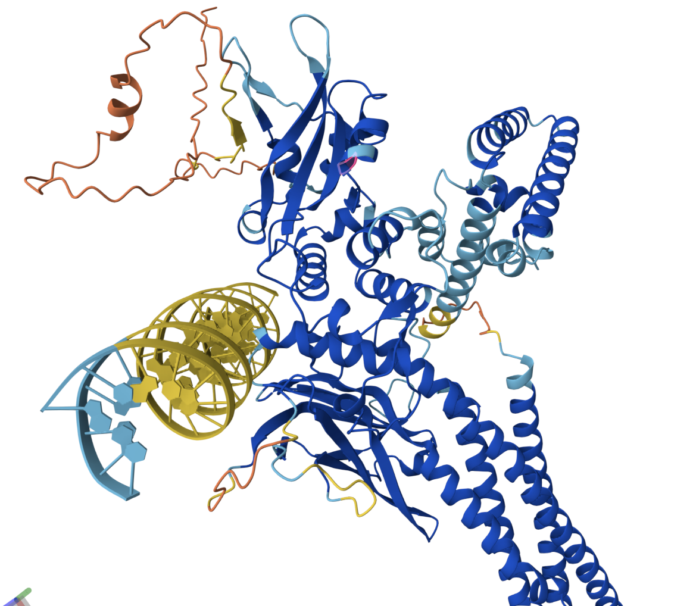
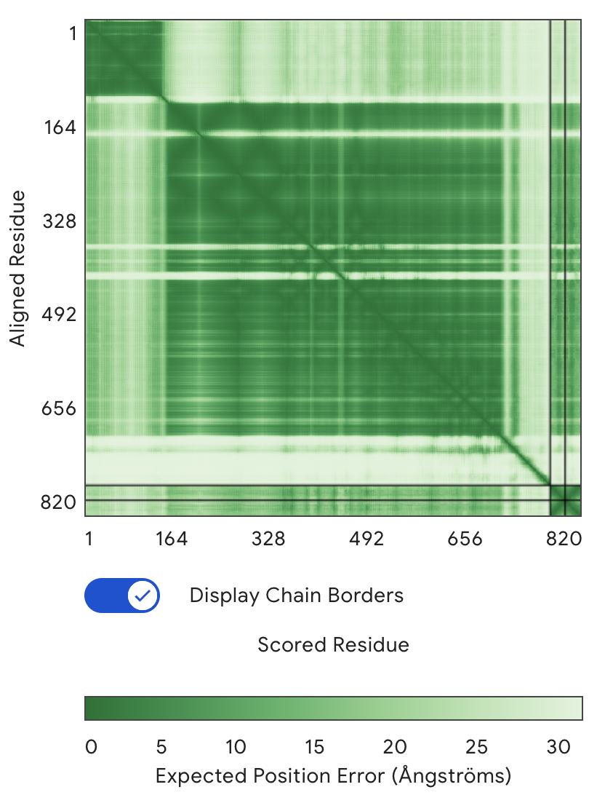
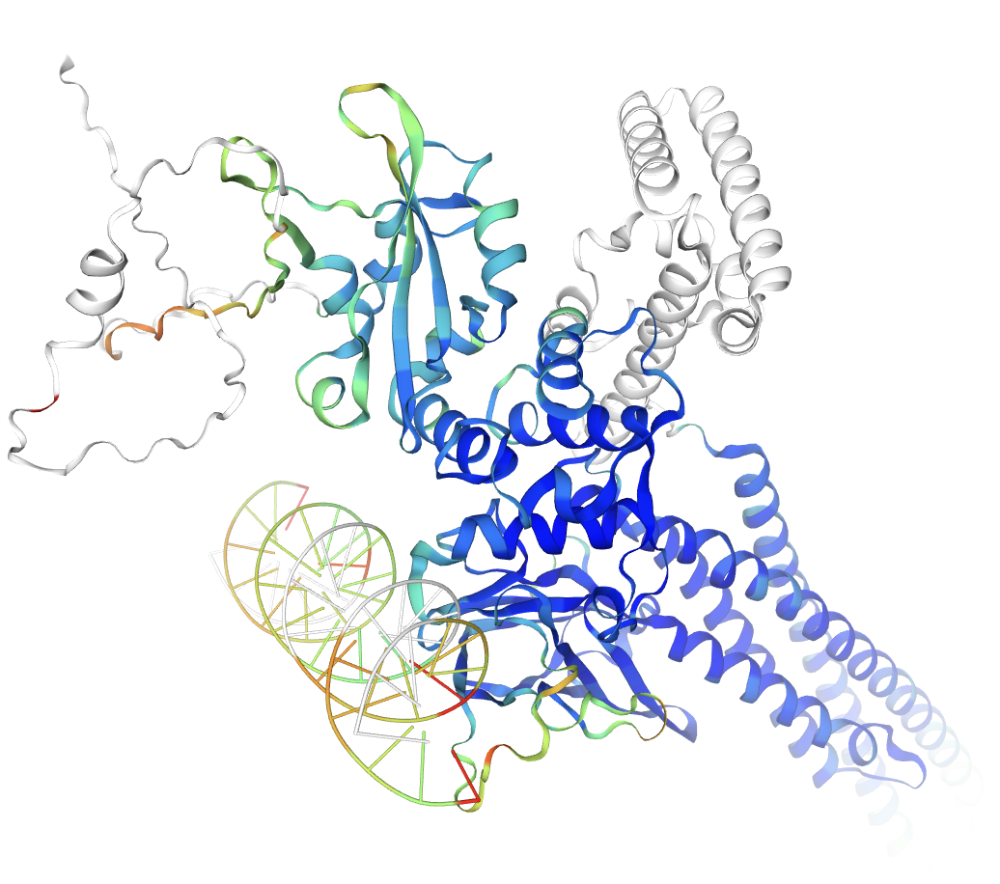
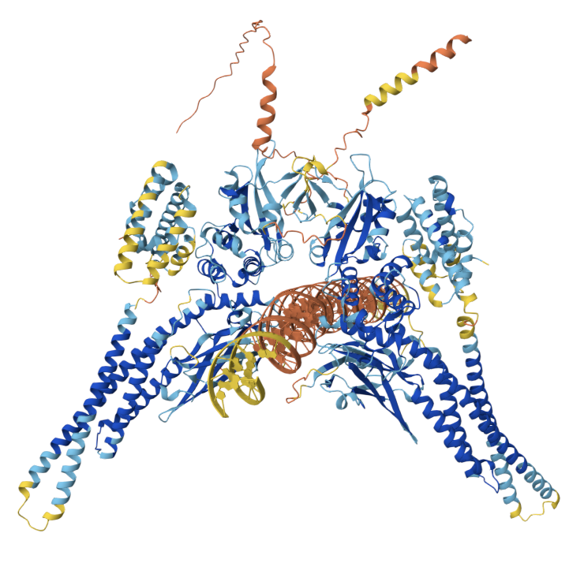
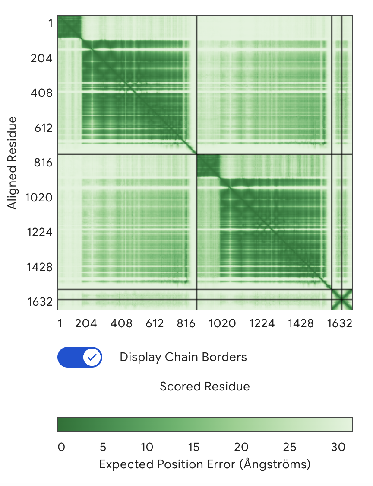

# Reporte de Práctica: Modelado estructural de estructura cuaternaria mediante AlphaFold3

## Introducción
La vía JAK-STAT es un mecanismo central de señalización inducido por citocinas que regula la expresión génica en procesos inflamatorios, antivirales y proliferativos. Entre los miembros de esta familia destacan:
- STAT3
- STAT1

Ambos factores de transcripción se activan por fosforilación en tirosina (Y701 en STAT1 y Y705 en STAT3), lo que promueve su dimerización mediante interacciones SH2-pTyr y su posterior unión a secuencias específicas de ADN conocidas como elementos GAS (Gamma-Activated Sites) con consenso:
`TTC(N₃)GAA`

Aunque frecuentemente forman homodímeros, existe evidencia de que pueden formar heterodímeros STAT1–STAT3, modulando diferencialmente la expresión génica dependiendo del contexto celular.

En esta práctica se modeló un complejo proteína-ADN compuesto por un heterodímero STAT1–STAT3 unido a una región promotora que contiene un elemento GAS, utilizando AlphaFold3.

## Objetivo
- Modelar un complejo proteína-ADN utilizando AlphaFold3
- Evaluar la calidad estructural del modelo obtenido.

## Materiales y Métodos

### Secuencias proteícas
Se utilizaron las secuencias humanas completas:

- STAT1 (UniProt: P42224)
- STAT3 (UniProt: P40763)

Cada proteína fue ingresada como cadena independiente en AlphaFold3.

### Secuencias de DNA
Se creo una secuencia de 25 bp, la cual contiene un elemento GAS
- `CGCATATTTATTCCCGGAATAGGCA`

Además, se seleccionó una región promotora que contiene un elemento GAS central, con una longitud de 60 pb para proporcionar contexto estructural adecuado. 
- `GCTGAGTTCCTGGGAAATTCCTGGGACTCTGAGTTTCCCGGAAAGGCTGACTGAGC`

Esta última secuencia proviene de estudios realizados por *He B. et al.* [Cloning and characterization of a functional promoter of the human SOCS-3 gene](https://doi.org/10.1016/S0006-291X(02)03071-1)
Los promotors de SOCS3 contienen sitios de unión del tipo GAS (STAT-binding elements) que pueden ser reconocidos por STATs. Dependiendo de la señal (IFN-γ vs IL-6), STAT1 o STAT3 pueden mediar la respuesta transcripcional; hay evidencia de que ambos STAT1 y STAT3 pueden interactuar en el promoto

### Configuración de AlphaFold

En el [servidor](https://alphafoldserver.com/) primero utilizamos la primer secuencia de 25 bp y STAT3 de manera que se modelo la interación de un monómero del TF y DNA.
Posteriormente se modelo a STAT1 y STAT3 junto con la secuencia del promotor del SOCS-3.

### 3.4 Evaluación estructural

Se analizaron las siguientes métricas:

- pLDDT (confianza local)

- PAE (Predicted Aligned Error)

- Confianza de interfaz proteína-proteína

- Confianza de interfaz proteína-ADN

Posteriormente, el modelo fue evaluado con la herramienta de evaluación estructural de [SWISS-MODEL](https://swissmodel.expasy.org/assess)
El modelo de referencia utilizado para la comparación estructural corresponde a un constructo sintético no fosforilado de STAT3 en forma de homodímero unido a ADN de doble cadena (dsDNA), resuelto mediante cristalografía de rayos X.

La estructura fue obtenida del Protein Data Bank bajo el identificador:

`4E68`

Esta estructura experimental se utilizó como referencia para evaluar la similitud estructural del modelo predicho, particularmente en la organización del dímero y en la orientación del dominio de unión a ADN respecto a la doble hélice.

## Resultados 

### Modelado de Monoméro STAT3 y DNA

La siguiente imagen muestra el modelado entre las dos estructuras:

Se observa que la mayor parte de la estructura proteica de STAT3 presenta valores de pLDDT superiores a 70, y predominantemente mayores a 90, lo que indica una alta confianza en la predicción estructural del monómero. Esto sugiere que el plegamiento global y los dominios estructurales principales fueron modelados con buena precisión por AlphaFold3.

Particularmente relevante es que la región implicada en la interacción con el ADN también muestra valores elevados de pLDDT, lo que indica que el dominio de unión a ADN presenta una conformación estructural confiable.

Sin embargo, la molécula de ADN presenta valores de pLDDT considerablemente más bajos. Esto puede interpretarse como una mayor incertidumbre en la posición o conformación del ADN dentro del complejo, lo cual es consistente con que:

- El ADN puede presentar mayor flexibilidad estructural.

- La predicción de complejos proteína-ADN sigue siendo más desafiante que la predicción de estructuras proteicas.

- La estabilidad del ADN depende fuertemente de la correcta formación de la interfaz proteína-ADN.

El modelo generado mostró valores globales de confianza de pTM = 0.75 e ipTM = 0.70.

El valor de pTM (predicted TM-score) indica una predicción estructural global consistente del complejo modelado. Por su parte, el ipTM (interface predicted TM-score) refleja una confianza adecuada en las interacciones entre cadenas dentro del ensamblaje.

En conjunto, estos valores sugieren que el modelo presenta una organización tridimensional estable y una interfaz intermolecular razonablemente bien definida.

Al analizar la gráfica de PAE (Predicted Aligned Error) se observa que predomina el color verde oscuro en la diagonal principal, lo que corresponde a errores menores a 5 Å. Esto indica una alta confianza en la relación espacial entre residuos dentro de cada dominio, reafirmando que los dominios internos de STAT3 están correctamente plegados.

En las regiones correspondientes a la intersección entre STAT3 y el ADN se observan valores de PAE relativamente bajos, lo que sugiere que el modelo ha predicho con coherencia la orientación del dominio de unión a ADN respecto a la doble hélice. Estos valores indican que el algoritmo logró posicionar el dominio de unión dentro del surco mayor del elemento GAS con una incertidumbre moderada a baja

#### Swiss-Model

##### Comparación de estructura global
| Métrica  | Valor |
| -------- | ----- |
| lDDT     | 0.41  |
| TM-score | 0.51  |
| RMSD (Å) | 3.40  |

El TM-score de 0.51 indica que el modelo conserva la arquitectura tridimensional global del plegamiento de STAT3, ya que valores ≥ 0.5 suelen asociarse con similitud estructural significativa.
El RMSD de 3.40 Å sugiere una desviación moderada respecto a la estructura experimental. Estas diferencias pueden deberse a variaciones conformacionales, diferencias de especie y condiciones experimentales.
El lDDT de 0.41 refleja discrepancias locales, pero es esperado debido a la diferencia entre el STAT3 humano y de ratón.

##### Comparación de interfases
| Interfaz (Referencia vs Modelo) | Contactos | DockQ | QS-score |
| ------------------------------- | --------- | ----- | -------- |
| A⋮C vs C⋮B                      | 49        | 0.19  | 0.01     |
| A⋮D vs C⋮A                      | 23        | 0.20  | 0.38     |
| C⋮D vs B⋮A                      | 19        | 0.28  | 0.21     |

##### Métricas del modelo
| Métrica         | Valor |
| --------------- | ----- |
| Global QS-score | 0.10  |
| Global QS-best  | 0.36  |
| DockQ-wave      | 0.21  |

Los valores de QS-score y DockQ indican que la organización de las interfaces cuaternarias del modelo difiere de la estructura experimental. Esto sugiere variaciones en la orientación relativa de las subunidades y en el empaquetamiento intermolecular.

Los resultados muestran que:

- El plegamiento terciario del monómero está globalmente conservado.

- Existen diferencias en la organización cuaternaria respecto a la estructura cristalográfica.

- Las interfaces proteína-proteína y proteína-ADN presentan variaciones geométricas moderadas.

Sin embargo, si analizamos la imagen: 

Podemos observar que la región de interacción presenta valores de **lDDT ~0.6-.8**, lo cual indica una confianza estructural moderadamente alta en esa zona del modelo.

### Modelado STAT1-STAT3 con promotor de SOCS-3

La siguiente imagen muestra el modelado entre las tres estructuras:

- En comparación con el modelo del **monómero de STAT3**, se observa una caída en la calidad estructural global.  
  - Fragmentos que previamente se mostraban en **azul oscuro** (alta confianza) ahora aparecen en **azul claro** e incluso **amarillo**, indicando menor confianza local.
- La estructura de **STAT1** presenta colores similares al nuevo modelo de STAT3, mostrando consistencia entre las subunidades.
- La **región de interacción proteína–DNA** mantiene valores de **pLDDT > 70**, aunque ligeramente menores que en modelos previos.
- La molécula de **DNA** muestra valores más bajos que en los modelos anteriores, lo que sugiere **mayor incertidumbre en la predicción de su geometría** dentro del complejo.

El modelo del complejo STAT3–STAT1–DNA mostró valores de confianza globales de pTM = 0.60 e ipTM = 0.51, lo que indica que la arquitectura global del ensamblaje se predice con confianza moderada, reflejando una organización tridimensional razonablemente coherente. La confianza en la interfaz proteína–proteína y proteína–DNA es menor que en modelos individuales de monómero, lo cual es consistente con la mayor complejidad del heterodímero y la inclusión del ADN en el complejo.

En conjunto, la disminución de pTM e ipTM en el modelo heterodimérico sugiere que, aunque AlphaFold3 logra predecir la estructura global del complejo, existe una incertidumbre moderada en las interacciones de la interfaz y en la posición del ADN, mientras que la organización tridimensional del monómero se mantiene más estable y confiable.

Con respecto al PAE, los dominios internos son mayoritariamente verde oscuro, lo que indica una confianza alta en el plegamiento de cada monómero por separado. Los cuadrantes fuera de la diagonal muestran parches verdes claros y bandas blancas, por lo que si bien aunque AlphaFold predice que están juntas, tiene un poco de incertidumbre sobre la orientación exacta de un monómero respecto al otro. Además Se observa un patrón en "X" verde oscuro en el extremo inferior derecho (~1600+), confirmando que el ADN está bien estructurado internamente y que el modelo ha posicionado los dominios de unión de STAT sobre él con relativa coherencia.

#### Swiss-Model
Durante el análisis de mapeo de cadenas:

| Modelo | Referencia |
|--------|------------|
| A      | D          |
| C      | C          |
| D      | A          |

Se detectó que **la cadena B del modelo (STAT1) no se mapeó a ninguna cadena de la referencia**, y viceversa:

- Chain B del modelo no se mapeó a la referencia.  
- Chain B de la referencia no se mapeó al modelo.  

Es de esperarse dadas las diferencias en la numeración de residuos y secuencia.

##### Comparación de estructura global
| Métrica  | Valor |
| -------- | ----- |
| lDDT     | 0.43  |
| TM-score | 0.95 |
| RMSD (Å) | 1.76  |

La comparación estructural del complejo STAT3–DNA en el modelo heterodimérico con la estructura de referencia (homodímero de STAT3 de ratón, PDB 4E68) mostró un lDDT de 0.43, un TM-score de 0.95 y un RMSD de 1.76 Å. Estos valores reflejan una mejora significativa en la predicción de la arquitectura global de STAT3–DNA respecto al modelo previo de STAT3 monómero, que presentó lDDT = 0.41, TM-score = 0.51 y RMSD = 3.40 Å. Esto indica que, al modelar el heterodímero (aunque STAT1 se eliminó del análisis), la posición y el plegamiento del STAT3 unido al ADN se benefició de la información del ensamblaje, mejorando la coherencia global y la precisión estructural en comparación con la predicción del monómero aislado. A pesar de estas mejoras, el lDDT moderado sigue reflejando diferencias locales, especialmente en las regiones de interacción y superficies más flexibles.

### Scores de interfaz

| Interfaz (Referencia vs Modelo) | Contactos | DockQ | QS-score |
|--------------------------------|-----------|--------|----------|
| A⋮C vs D⋮C | 49 | 0.68 | 0.42 |
| A⋮D vs D⋮A | 23 | 0.64 | 0.64 |
| C⋮D vs C⋮A | 19 | 0.79 | 0.92 |

#### Métricas globales

| Métrica | Valor |
|----------|-------|
| Global QS-score | 0.11 |
| Global QS-best  | 0.85 |
| DockQ-wave      | 0.70 |

 A pesar del mapeo incompleto de STAT1, las interfaces **presentan valores altos de DockQ y QS-score** en algunas combinaciones, especialmente C⋮D vs C⋮A, lo que indica buena coincidencia en la geometría de la interacción proteína–ADN.
- La **Global QS-score** relativamente baja (0.11) refleja que el mapeo incompleto reduce la puntuación global de similitud de ensamblaje cuaternario.
- Los valores de **Global QS-best** y **DockQ-wave** altos (0.85 y 0.70) indican que existen regiones del complejo que están muy bien predichas en términos de interfaces.

Estos resultados indican que, al modelar el heterodímero (aunque STAT1 se eliminó del análisis), la posición y el plegamiento de STAT3 unido al ADN se beneficia de la información del ensamblaje, aumentando la coherencia global y la precisión estructural. En general, este modelo heterodimérico supera al modelo de monómero de STAT3, mostrando mayor estabilidad y una organización tridimensional más confiable, aunque algunas regiones de interacción mantienen incertidumbre local moderada.

## Conclusión
En esta práctica se modelaron complejos proteína–ADN utilizando AlphaFold3 para comparar el desempeño del algoritmo en dos escenarios: (1) un monómero de STAT3 unido a un elemento GAS y (2) un heterodímero STAT1–STAT3 unido al promotor de SOCS3.

Los resultados muestran que el modelo del monómero STAT3–DNA presentó alta confianza en el plegamiento terciario (pLDDT elevado y pTM = 0.75), pero una concordancia estructural moderada frente a la estructura experimental 4E68 (TM-score = 0.51; RMSD = 3.40 Å), evidenciando diferencias en la organización cuaternaria e interfaces.

En contraste, el modelo del heterodímero STAT1–STAT3–DNA mostró una mejora significativa en la arquitectura global de STAT3 unido al ADN (TM-score = 0.95; RMSD = 1.76 Å). Aunque los valores globales de pTM (0.60) e ipTM (0.51) fueron menores —reflejando mayor complejidad y cierta incertidumbre en la orientación entre subunidades— las métricas de interfaz (DockQ y QS-score) indicaron una mejor definición geométrica en regiones clave proteína–ADN.

En síntesis, los resultados obtenidos indican que:

- AlphaFold3 predice con alta precisión el plegamiento individual de STATs.

- El modelado del ensamblaje completo mejora la coherencia estructural del complejo STAT3–DNA.

- La inclusión del contexto cuaternario favorece una mejor organización global, aunque introduce incertidumbre moderada en algunas interfaces.

- El modelo heterodimérico supera al modelo monomérico en términos de similitud estructural con la referencia experimental.

Por lo tanto, la práctica demuestra que el modelado de complejos completos proporciona predicciones estructurales más informativas que el análisis de subunidades aisladas

