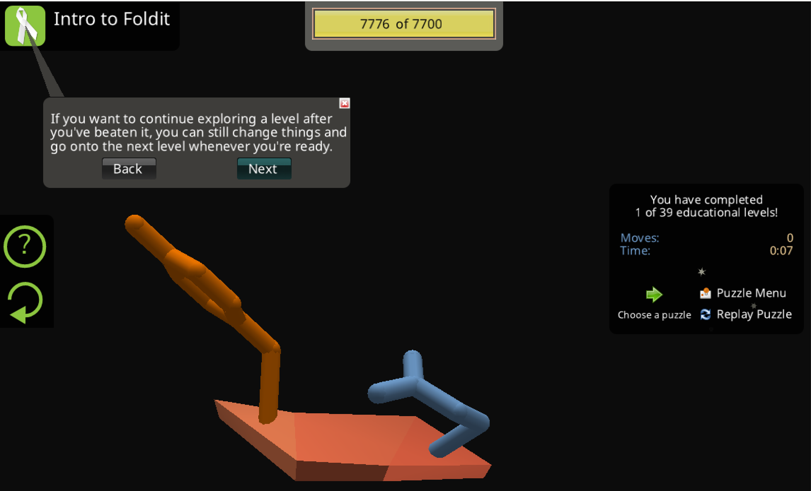
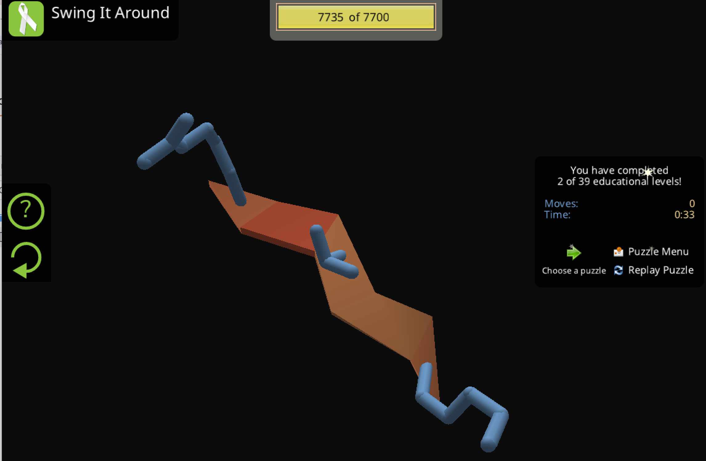
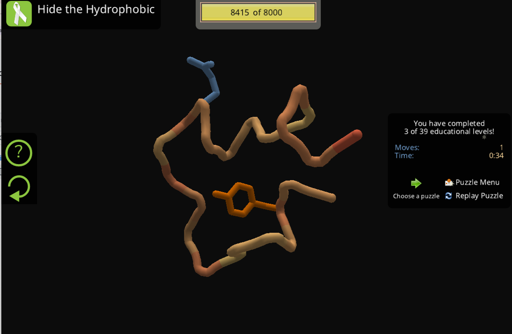
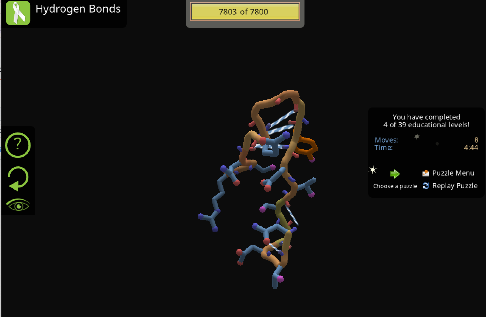
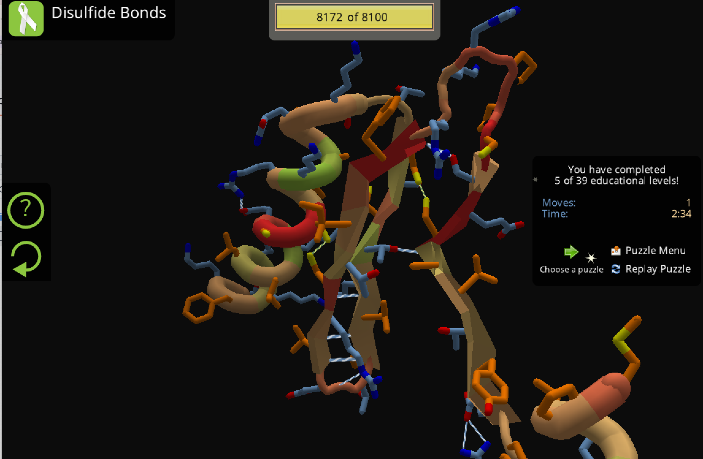
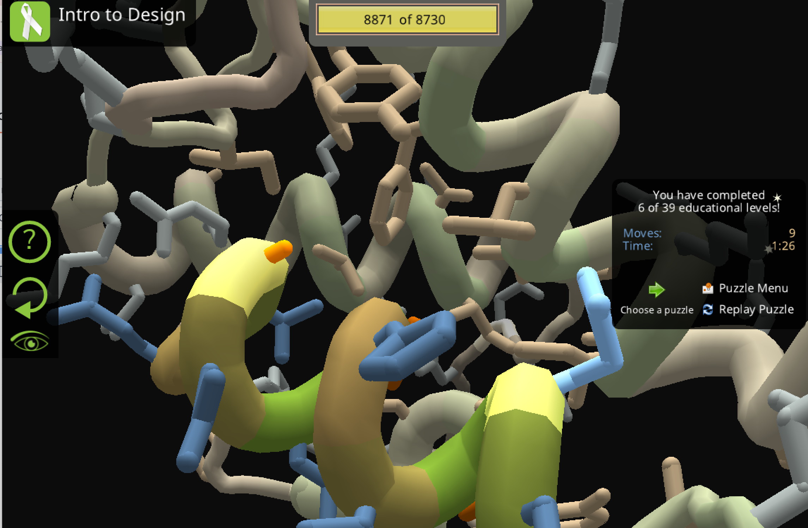
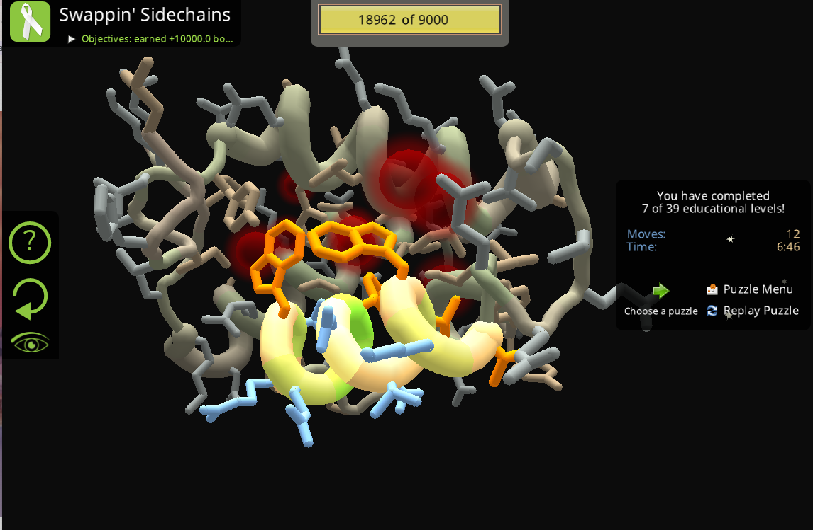
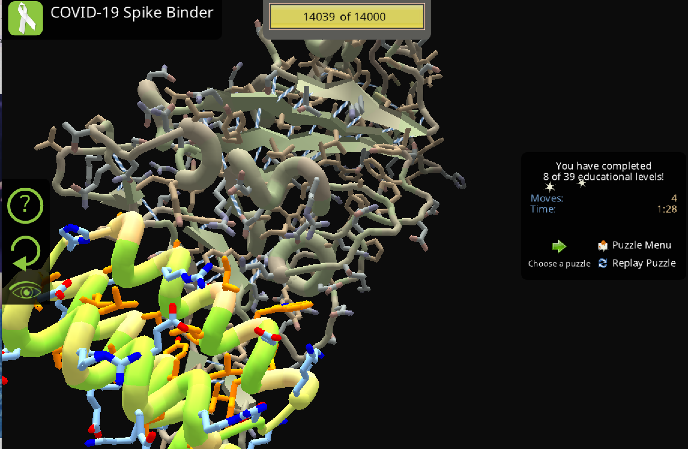

# Foldit
**Foldit** es un videojuego científico interactivo diseñado para explorar el **plegamiento de proteínas** mediante la participación de usuarios no expertos.

## ¿Qué hace?

- Permite manipular estructuras tridimensionales de proteínas.
- Los jugadores intentan encontrar conformaciones con **menor energía**.
- Utiliza un motor basado en principios físicos similares a los empleados en modelado estructural profesional.

## Objetivo científico

- Optimizar estructuras proteicas.
- Resolver problemas estructurales difíciles.
- Diseñar nuevas proteínas con funciones específicas.

En algunos casos, jugadores de Foldit han logrado:

- Mejorar modelos estructurales.
- Resolver estructuras que habían sido difíciles de determinar experimentalmente.
- Diseñar proteínas artificiales funcionales.

## Relación con la estructura proteica

Foldit se basa en principios clave del plegamiento:

- Minimización de energía libre.
- Formación de núcleos hidrofóbicos.
- Optimización de puentes de hidrógeno.
- Reducción de choques estéricos.

El sistema puntúa las estructuras según su estabilidad energética.

Foldit trabaja tradicionalmente con estructuras en formato **PDB**, no mmCIF.
Foldit es una herramienta educativa y científica que permite comprender de manera práctica cómo la estructura tridimensional de una proteína depende de la optimización energética y de las interacciones internas que estabilizan su conformación.

## Ejericio
Como actividad práctica de la sesión, se nos asignó:

**Jugar Foldit**, con el objetivo de explorar de manera interactiva los principios del plegamiento de proteínas y comprender cómo la optimización energética influye en la conformación tridimensional.

## Conclusión 
El ejercicio con **Foldit** permitió comprender de manera práctica los principios fundamentales del plegamiento de proteínas. Al manipular directamente la estructura tridimensional y observar cómo cambia la puntuación energética, se hizo evidente que:

- La conformación nativa corresponde a un estado de **mínima energía**.
- La formación de un **núcleo hidrofóbico** es clave para la estabilidad.
- Los **puentes de hidrógeno** estabilizan la estructura secundaria.
- Los choques estéricos y tensiones geométricas aumentan la energía del sistema.

Además, la actividad ayudó a visualizar cómo pequeños cambios en la conformación pueden afectar significativamente la estabilidad global de la proteína.

En conclusión, Foldit funciona como una herramienta didáctica que refuerza la relación entre **estructura, energía y función**, permitiendo internalizar conceptos teóricos de biología estructural mediante una experiencia interactiva.
