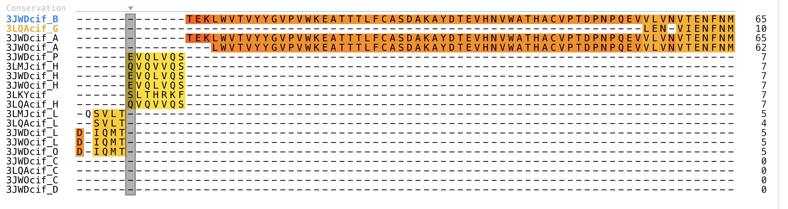
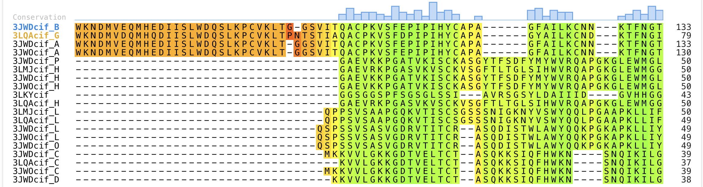
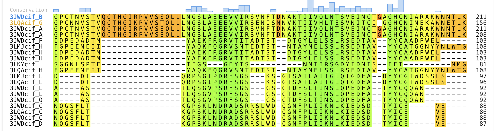
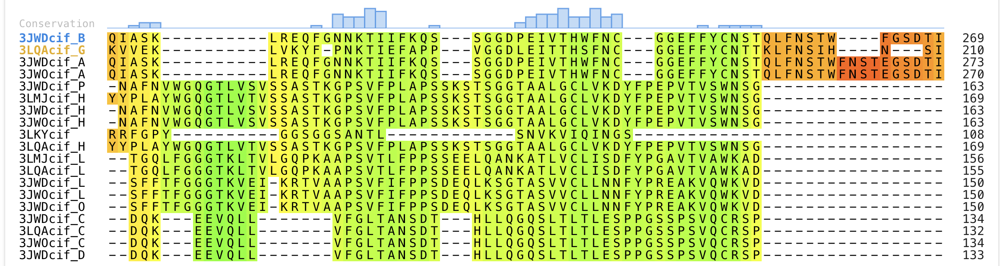
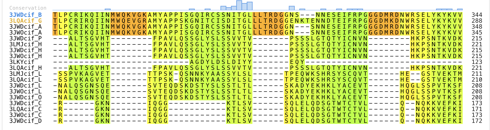
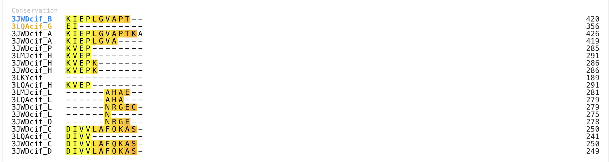
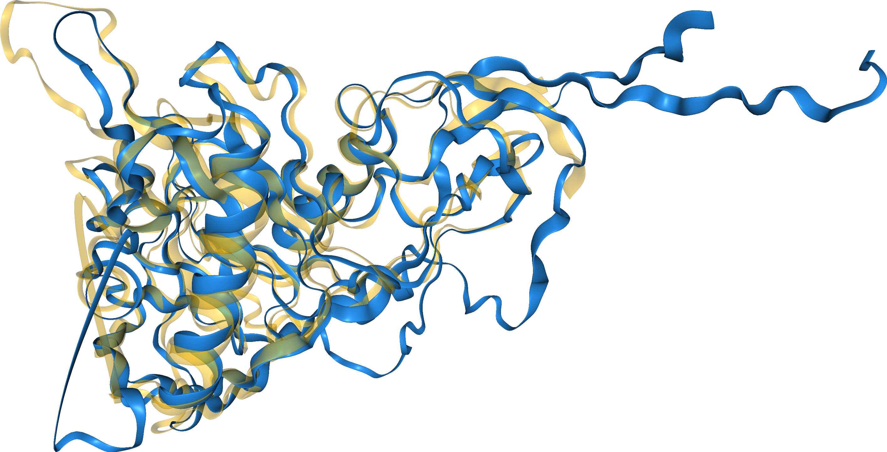
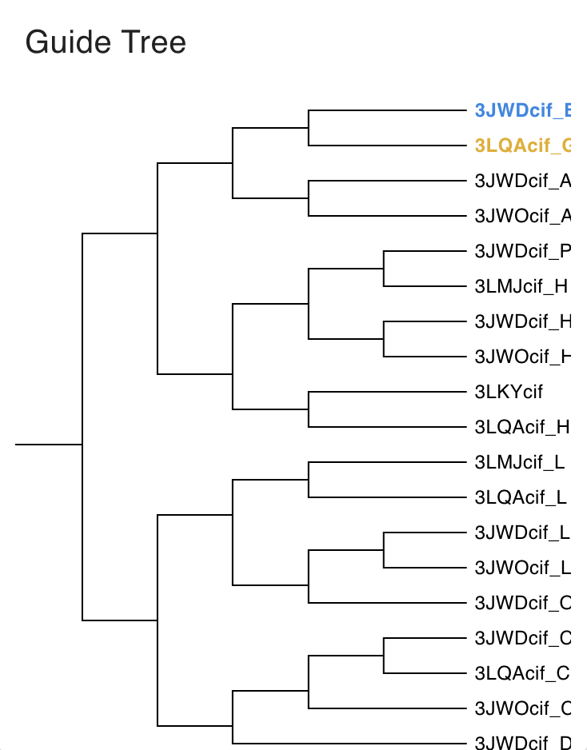

 # Reporte de Práctica: Alineamientos y Superposiciones Estructurales

## **Objetivo**

El objetivo de esta práctica fue aprender a:

1. Realizar **alineamientos estructurales** entre dominios proteicos relacionados.
2. Visualizar y **interpretar superposiciones tridimensionales** de proteínas.
3. Extraer métricas cuantitativas de similitud estructural (*% identidad*, *RMSD*)

## 1. Selección de dominios estructurales

CATH es una base de datos de clasificación estructural de proteínas que organiza los dominios según una jerarquía basada en su arquitectura tridimensional. Su nombre proviene de los cuatro niveles principales de clasificación:

- **C**lass (Clase estructural)
- **A**rchitecture (Arquitectura global)
- **T**opology (Topología o fold)
- **H**omologous superfamily (Superfamilia homóloga)

Esta clasificación permite identificar relaciones estructurales y evolutivas entre proteínas, incluso cuando su similitud de secuencia es baja.

Para esta práctica se buscó el dominio `gp120`, la glicoproteína envoltura del virus de la inmunodeficiencia humana (VIH), responsable de la unión al receptor CD4 en células huésped.
A partir de la búsqueda en CATH, se seleccionaron 5 proteínas con  dominios relacionados estructuralmente para su comparación y superposición.

| **Código PDB** | **Descripción breve** |
|----------------|-----------------------|
| 3WJD           | gp120 con región interactiva con gp41 |
| 3LQA           | gp120 del clado C en complejo con CD4 soluble (sCD4) y anticuerpo 21c (Fab) |
| 3JWO           | gp120 con región interactiva con gp41 |
| 3LKY           | Griffithsin monomérica con inserción Gly-Ser |
| 3LMJ           | Fragmento Fab del anticuerpo humano anti-VIH 21c |

Las estructuras 3WJD, 3LQA y 3JWO contienen directamente el dominio gp120 del VIH en distintos contextos estructurales (formas libres o en complejo).

Por otro lado:

- **3LKY** corresponde a Griffithsin, una lectina con actividad antiviral que puede unirse a glicoproteínas virales.
- **3LMJ** corresponde al fragmento Fab del anticuerpo humano 21c, que reconoce epítopos en gp120.

La inclusión de estructuras en complejo permite analizar no solo la conservación del núcleo estructural de gp120, sino también posibles cambios conformacionales inducidos por la unión a receptores o anticuerpos.

Dadas esas proteínas obtuvimos los siguientes dominios: 

| **Dominio** | **Estructura PDB** |
|-------------|-------------------|
| 3JWDcif_B    | 3JWD |
| 3LQAcif_G   | 3LQA |
| 3JWDcif_A | 3JWD |
| 3JWOcif_A   | 3JWO |
| 3JWDcif_P   | 3JWD |
| 3LMJcif_H   | 3LMJ |
| 3JWDcif_H   | 3JWD |
| 3JWOcif_H   | 3JWO |
| 3LKYcif     | 3LKY |
| 3LQAcif_H   | 3LQA |
| 3LMJcif_L   | 3LMJ |
| 3LQAcif_L   | 3LQA |
| 3JWDcif_L   | 3JWD |
| 3JWOcif_L   | 3JWO |
| 3JWDcif_O    | 3JWD |
| 3JWDcif_C    | 3JWD |
| 3LQAcif_C   | 3LQA |
| 3JW0cif_C   | 3JW0 |
| 3JWDcif_D    | 3JWD |

## 2. Alineamiento y superposición en FoldMason

FoldMason es una herramienta para realizar alineamientos estructurales múltiples de proteínas. Funciona convirtiendo la información tridimensional (3D) de cada estructura en una secuencia basada en un alfabeto estructural, lo que permite comparar estructuras de manera rápida usando algoritmos similares a los de alineamiento de secuencias.

Se accedió a **https://search.foldseek.com/foldmason** y se ingresaron las estructuras PDB de los dominios seleccionados.

### 2.1 Visualización de FoldMason

- **Resumen de alineamiento**: La siguiente figura muestra el resumen generado por FoldMason tras el alineamiento múltiple de las estructuras seleccionadas. En esta visualización se observa la superposición tridimensional y el alineamiento correspondiente entre los dominios analizados.
La coloración está basada en la métrica **lDDT (local Distance Difference Test)**, que evalúa la conservación estructural local sin depender directamente de una superposición global rígida.

El alineamiento presenta un **lDDT promedio de 0.476**. Se pueden observar regiones con un altob grado de conservación en su estrutura local. 

- **Alineamiento**: Las siguiente figura muestra el alineamiento de los 19 dominios. Además pueden consular en alineamiento en `data/foldmason_aa.fa`.
  

- **Comparción estructural de los dominios**: La siguiente figura muestra la superposición estructural de los dominios. Pueden consultar de igual manera la superposición en formato pdb en `data/foldmason.pdb`.

- **Guide Tree**: La siguiente figura muestra el *guide tree* generado durante el alineamiento múltiple estructural. Este árbol refleja las relaciones de similitud estructural entre los dominios analizados, agrupándolos según su grado de conservación. Las ramas más cortas indican estructuras más similares entre sí, mientras que ramas más largas sugieren mayor divergencia estructural. Se observa que algunas estructuras, como 3JWDcif_E y 3LQAcif_G, se agrupan estrechamente, lo que indica una mayor similitud estructural entre ellas. Esto sugiere que comparten un núcleo conformacional altamente conservado, así como 3JWOcif_H y 3JWDcif_H 

## Foldseek
Foldseek es una herramienta para buscar y comparar estructuras de proteínas de forma extremadamente rápida, mediante alfabetos estructurales.
Los resultados de FoldMason se pasaron a Foldseek y nos devolvió 633 hits repartidos en 8 bases de datos. Las tablas por base de datos se pueden ver en `results/foldseek`

| **Base de datos** | **Número de hits** |
|-------------------|--------------------|
| PDB100            | 433 |
| BFVD              | 132 |
| AFBD-PROTEOME     | 1 |
| AFBD50            | 3 |
| BFMD              | 2 |
| CATH50            | 8 |
| GMGC_ID           | 1 |
| mgnify_esm30      | 3 |

### PDB100 – 433 hits

PDB100 corresponde al conjunto no redundante del Protein Data Bank al 100% de identidad e incluye únicamente estructuras determinadas experimentalmente (cristalografía de rayos X, RMN o cryo-EM).

Se espera que esta base de datos presente el mayor número de coincidencias, dado que gp120 es una glicoproteína viral ampliamente estudiada por su papel central en la entrada del VIH en la célula huésped.

En este caso, todos los hits presentan un **E-value < 0.05**, lo que indica que las similitudes estructurales detectadas son estadísticamente significativas y no atribuibles al azar.

Las coincidencias corresponden principalmente a:

- Proteínas virales del HIV.
- Proteínas del virus relacionado SIV.
- Complejos de gp120 con proteínas del sistema inmune (anticuerpos, fragmentos Fab, CD4).

Además, los principales hits coinciden con las estructuras utilizadas en el análisis estructural realizado en esta práctica, lo que valida la coherencia interna de los resultados obtenidos mediante FoldMason y Foldseek.

---

### BFVD (Big Fantastic Virus Database) – 132 hits

De los 132 hits obtenidos, aproximadamente **66 presentan un E-value < 0.05**, indicando coincidencias estructurales significativas. Los restantes resultados podrían reflejar similitudes más débiles o parciales.

La mayoría de los hits significativos corresponden a:

- Proteínas de la envoltura viral.
- Fragmentos de proteínas de envoltura.
- La proteína gp160 de distintas cepas de HIV.

Esto es coherente biológicamente, ya que **gp120 forma parte de gp160** (precursor que luego se escinde en gp120 y gp41). Por lo tanto, es esperable detectar similitud estructural con gp160 y otras glicoproteínas de envoltura viral que comparten arquitectura tridimensional relacionada con el reconocimiento y la entrada celular.

---

### AFBD-PROTEOME (AlphaFold Database – proteomas completos) – 1 hit

Esta base de datos contiene estructuras predichas por AlphaFold correspondientes a proteomas completos de distintos organismos.

En este caso, se obtuvo un solo hit, **no estadísticamente significativo** (E-value = 6.13e+0), correspondiente a una **SWIM-type domain-containing protein** de un nematodo.  

Dado el valor elevado del E-value, esta coincidencia probablemente refleja similitud estructural débil o parcial, atribuible a características estructurales generales (como motivos secundarios comunes) más que a una relación evolutiva real con gp120.

---

### AFDB50 – 3 hits

AFDB50 es un subconjunto no redundante (50% de identidad máxima) de estructuras predichas por AlphaFold. Esta reducción de redundancia permite detectar homologías estructurales más remotas, evitando que múltiples variantes muy similares influyan en los resultados.

De los tres hits obtenidos:

- **Uno** supera el umbral de significancia estadística y corresponde al **core estructural de gp120 del HIV**, coherente con el análisis realizado.
- **Otro** no es significativo según el E-value, pero corresponde a una **Retroviral envelope protein GP41-like domain-containing protein**, sugiriendo cierta relación estructural dentro de proteínas de envoltura retroviral.
- **El tercero** es una proteína anotada como **unknown**, sin caracterización funcional clara, y tampoco es significativo.

En conjunto, estos resultados indican que, incluso en un conjunto amplio de estructuras predichas, las coincidencias estructurales relevantes se restringen principalmente a proteínas retrovirales relacionadas, reforzando la **especificidad estructural de gp120** dentro de este grupo funcional.

---

### BFMD (Big Fantastic Microbial Database) – 2 hits

Base de datos de proteínas microbianas provenientes de estudios metagenómicos.  
De los dos hits, solo **uno es significativo**, correspondiente a un **modelo teórico de interacción entre el receptor CCR5, GP120 del VIH y el receptor CD4**.

---

### CATH50 – 8 hits

Conjunto no redundante (50% de identidad) de dominios clasificados en CATH.  
De los 8 hits, **5 son significativos**, y todos corresponden a **gp120_chainG** de HIV o SIV.

---

### GMGC_ID (Global Microbial Gene Catalog) – 1 hit

Base de datos derivada de estudios metagenómicos globales, diseñada para identificar homologías estructurales en proteínas microbianas ambientales.  

El hit corresponde a **Staphylococcus aureus**, que presenta motivos estructurales similares a **gp120 y gp41**, sugiriendo conservación de ciertos plegamientos o superficies de interacción. Aunque proviene de un microorganismo ambiental, este hallazgo indica un **paralelismo estructural interesante con proteínas virales**.

---

### mgnify_esm30 – 3 hits

Base de datos metagenómica basada en modelos estructurales predichos (ESMFold), con redundancia reducida (~30%).  
De los tres hits, **ninguno es significativo**, indicando que no se detectaron coincidencias estructurales relevantes con gp120/gp41.

## RMDS

